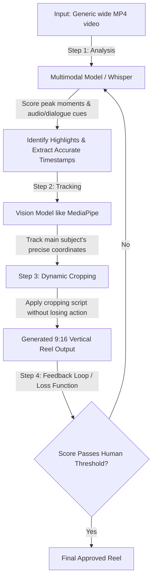

Reframe AI v2

```mermaid
graph TD
    A[Input: Generic wide MP4 video] -->|Step 1: Analysis| B[Multimodal Model / Whisper]
    B -->|Score peak moments & audio/dialogue cues| C[Identify Highlights & Extract Accurate Timestamps]
    C -->|Step 2: Tracking| D[Vision Model like MediaPipe]
    D -->|Track main subject's precise coordinates| E[Step 3: Dynamic Cropping]
    E -->|Apply cropping script without losing action| F[Generated 9:16 Vertical Reel Output]
    F -->|Step 4: Feedback Loop / Loss Function| G{Score Passes Human Threshold?}
    G -->|Yes| H[Final Approved Reel]
    G -->|No| B
```